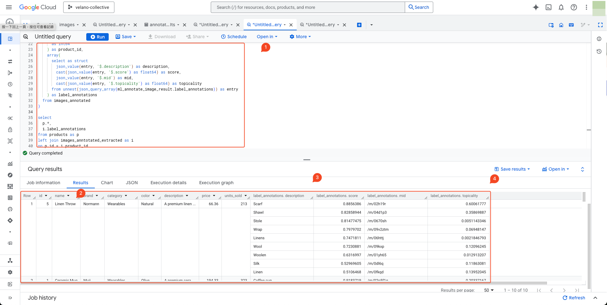

# Analyze Visual Cues That Drive Purchases

<figure markdown="span">
  
</figure>

```sql
with products as (
  select
    *
  from `velano-collective-ac8f.products_aws.products`
),
images_annotated as (
  select
    *
  from ml.annotate_image(
    model `velano-collective-ac8f.products.vision`,
    table `velano-collective-ac8f.products.images`,
    struct(['LABEL_DETECTION'] as vision_features)
  )
),
images_anntotated_extracted as (
  select
    cast(
      split(
        split(uri, "/")[offset(array_length(split(uri, '/')) - 1)], -- 1.png
        '.'
      )[offset(0)] -- 1
    as int64
    ) as product_id,
    array(
      select as struct
        json_value(entry, '$.description') as description,
        cast(json_value(entry, '$.score') as float64) as score
        cast(json_value(entry, '$.topicality') as float64) as topicality
      from unnest(json_query_array(ml_annotate_image_result.label_annotations)) as entry
    ) as label_annotations
  from images_annotated
)

select
  p.*,
  i.label_annotations
from products as p
left join images_anntotated_extracted as i
on p.id = i.product_id
```

