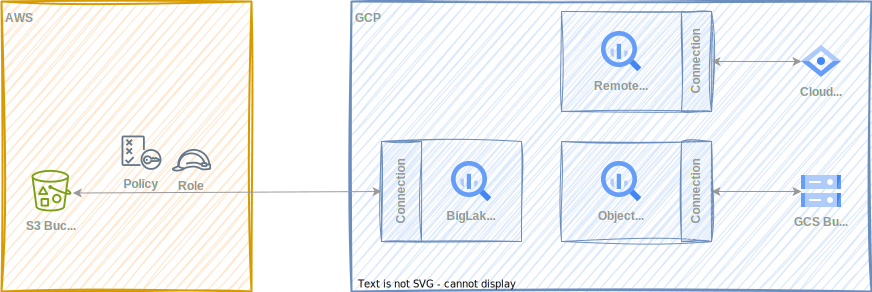

# Analyze Visual Cues That Drive Purchases

<figure markdown="span">
  
</figure>

```sql
with products as (
  select
    *
  from `kcl-tw-data-7c9b.products_aws.products`
),
images_annotated as (
  select * from ml.annotate_image(
    model `kcl-tw-data-7c9b.products.vision`,
    table `kcl-tw-data-7c9b.products.images`,
    struct(['IMAGE_PROPERTIES'] AS vision_features)
  )
)
```