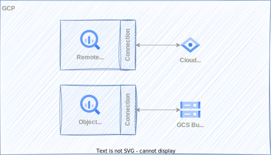
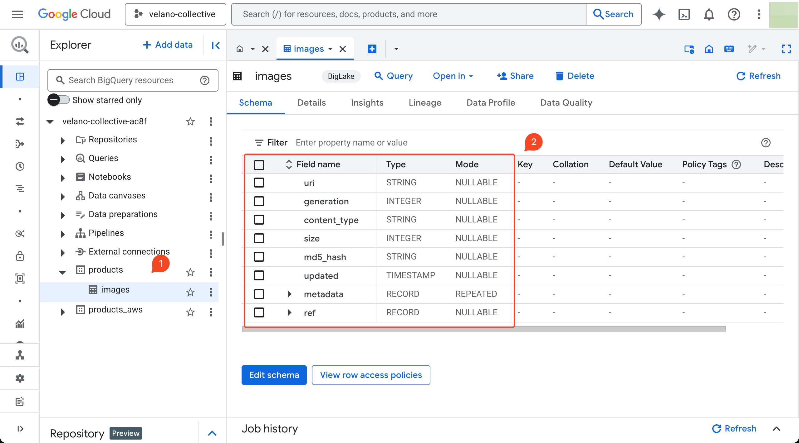
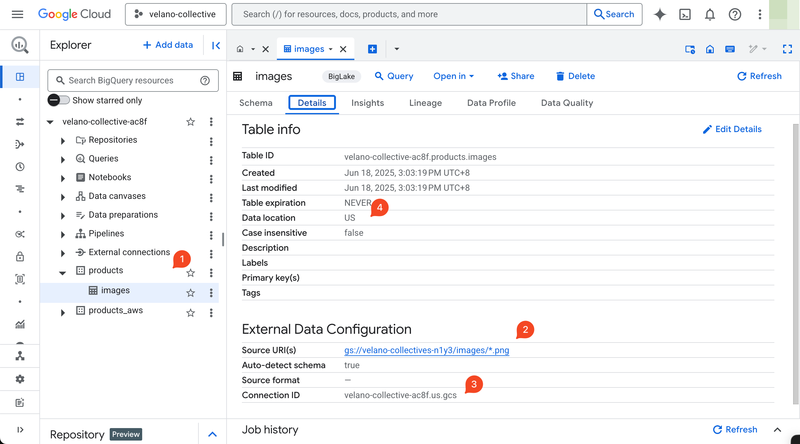
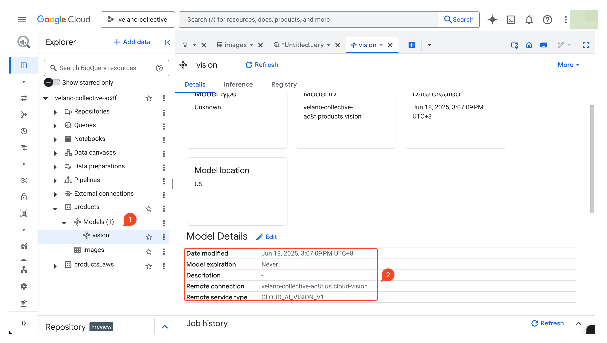
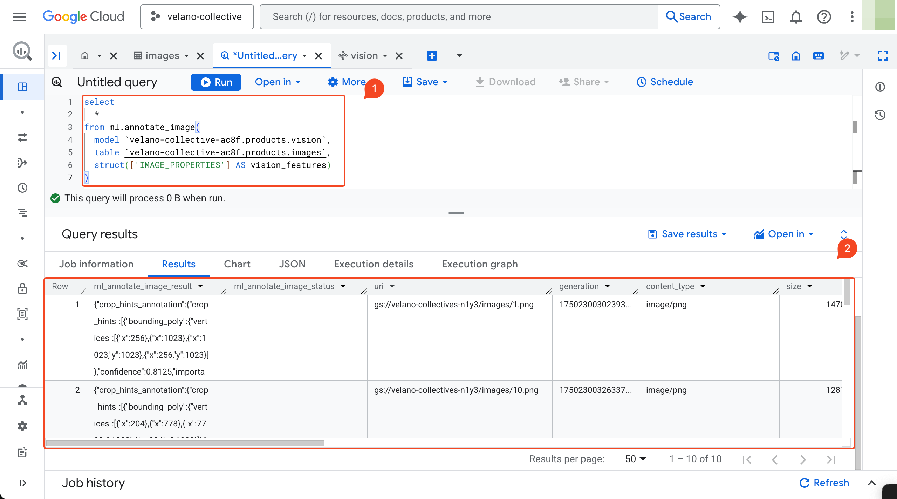

# Annotate Product Images

<figure markdown="span">
  
  <figcaption>Annotate product images using BigQuery and Cloud Vision</figcaption>
</figure>


## Create a Cloud Storage Bucket and Upload Images

Create a Google Cloud Storage bucket to store product images. The bucket should be in the `us` region and named `velano-collectives-n1y3`. You can use the following Terraform code to create the bucket:

```terraform
--8<-- "./velano-collectives/infra/gcp-gcs.tf:velano-collectives"
```

After creating the bucket, upload your product images to it. You can use the `gsutil` command-line tool to copy images from your local machine to the Cloud Storage bucket:

```bash
gsutil cp velano-collectives/data/images/*.png gs://velano-collectives-n1y3/images/
```
## Create a Dataset

```sql
create schema if not exists products
options(
  location="us"
)
```

## Create an Object Table

Create a BigQuery connection to the Cloud Storage bucket containing the images:

```terraform
--8<-- "./velano-collectives/infra/gcp-bq-conns.tf:gcs"
```

The connection's service account must have the following roles:

- `roles/storage.objectViewer`
- `roles/serviceusage.serviceUsageConsumer`

Create an object table in BigQuery to reference the images stored in the Cloud Storage bucket:

```sql
create external table `velano-collective-ac8f.products.images`
with connection `velano-collective-ac8f.us.gcs`
options(
  object_metadata = 'SIMPLE',
  uris = ['gs://velano-collectives-n1y3/images/*.png']
)
```






## Create a Remote Model

Create a BigQuery connection to the Cloud Vision API:

```terraform
--8<-- "./velano-collectives/infra/gcp-bq-conns.tf:cloud-vision"
```

After creating the connection, you can create a remote model that uses the Cloud Vision API to annotate images:

```sql
create or replace model `velano-collective-ac8f.products.vision`
remote with connection `velano-collective-ac8f.us.cloud-vision`
options(
    remote_service_type='CLOUD_AI_VISION_V1'
)
```



## Annotate images

When you have the object table and remote model set up, you can use the `ML.ANNOTATE_IMAGE` function to annotate the images. This function allows you to specify which vision features you want to extract from the images.

```sql
select
  *
from ml.annotate_image(
  model `velano-collective-ac8f.products.vision`,
  table `velano-collective-ac8f.products.images`,
  struct(['LABEL_DETECTION'] AS vision_features)
)
```



## References

- [Annotate images with the `ML.ANNOTATE_IMAGE` function](https://cloud.google.com/bigquery/docs/annotate-image)
- [Create object tables](https://cloud.google.com/bigquery/docs/object-tables)
- [The ML.ANNOTATE_IMAGE function](https://cloud.google.com/bigquery/docs/reference/standard-sql/bigqueryml-syntax-annotate-image)