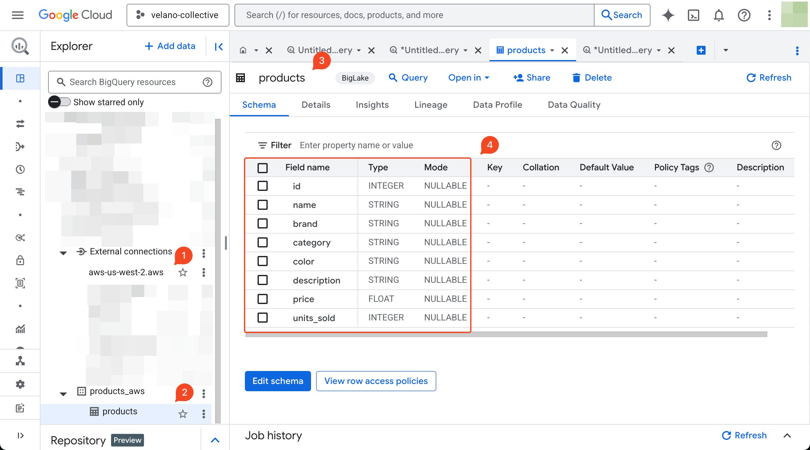
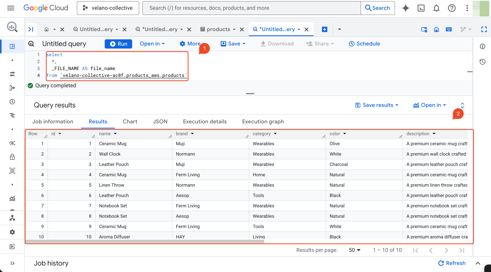

# Amazon S3 BigLake External Table

<figure markdown="span">
  
  <figcaption> Cross-cloud Data Pipelines with Amazon S3 BigLake</figcaption>
</figure>

## Create Amazon S3 Bucket and Upload Data

Create an Amazon S3 bucket in the `us-west-2` to store the data that you want to query with BigQuery. 

```terraform title="aws-s3.tf"
--8<-- "velano-collectives/infra/aws-s3.tf:velano-collectives"
```

`products.csv` is a sample data file that you can upload to the S3 bucket.

## Connect to Amazon S3

In order to connect BigQuery to Amazon S3, you need to create a BigQuery connection that allows BigQuery to access data stored in S3. This involves creating an AWS IAM policy and role, configuring a trust relationship, and setting up the BigQuery connection.

Here are the steps to follow:

1. Create an AWS IAM Policy and Role for BigQuery
2. Create a BigQuery connection
3. Add a trust relationship to the AWS role
    - Add a trust policy to the AWS role
    - Configure a custom AWS identity provider

See [Connect to Amazon S3](https://cloud.google.com/bigquery/docs/omni-aws-create-connection) for more details.

After completing these steps, the AWS IAM policy and role would look like this:

```terraform title="aws-iam.tf" linenums="1"
--8<-- "velano-collectives/infra/aws-iam.tf:bigquery"
```

And the BigQuery connection would look like this:


```terraform title="gcp-bq-conns.tf" linenums="1"
--8<-- "velano-collectives/infra/gcp-bq-conns.tf:aws"
```

---

## Create Amazon S3 BigLake Tables

### Create a Dataset

```sql 
create schema if not exists products_aws
options (
  location = 'aws-us-west-2'
)
```


### Create a Table

```sql
create external table products_aws.products
with connection `aws-us-west-2.aws`
options (
  format = "csv",
  uris = ["s3://velano-collectives-n1y3/products.csv"]
)
```



---

## Query Amazon S3 BigLake Tables

In order to query the Amazon S3 BigLake table, you need to have the following roles assigned to your user or service account:

- BigQuery Connection User (`roles/bigquery.connectionUser`)
- BigQuery Data Viewer (`roles/bigquery.dataViewer`)
- BigQuery User (`roles/bigquery.user`)

After you have the necessary permissions, you can query the table to see the data:

```sql
select
  *,
  _FILE_NAME AS file_name
from `velano-collective-ac8f.products_aws.products`
```



## References

- [Connect to Amazon S3](https://cloud.google.com/bigquery/docs/omni-aws-create-connection)
- [Create Amazon S3 BigLake external tables](https://cloud.google.com/bigquery/docs/omni-aws-create-external-table)
- [Query Amazon S3 data](https://cloud.google.com/bigquery/docs/query-aws-data)